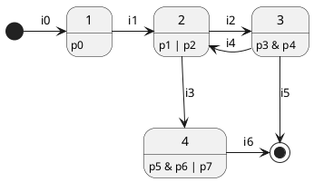
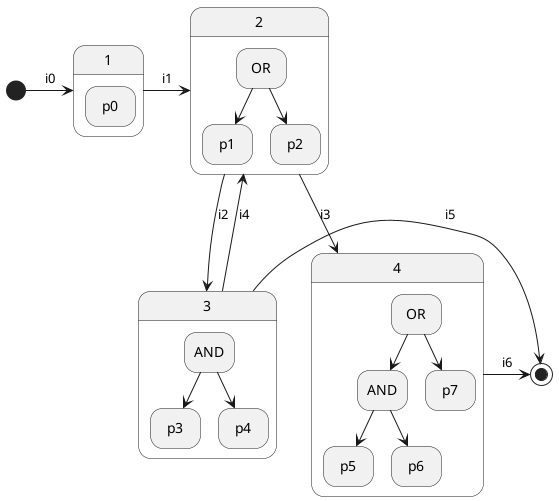

```plantuml
@startuml
hide empty description
state 1: p0
state 2: p1 | p2
state 3: p3 & p4
state 4: p5 & p6 | p7

[*]->1 :i0
1->2 :i1
2->3 : i2
2-->4 : i3
3->2 : i4
3->[*] : i5
4->[*]  : i6
@enduml
```

```plantuml
@startuml
hide empty description
state 1 {
    state p0
}
state 2 {

    state auto_0 as "OR"
    state auto_1 as "p1"
    state auto_2 as "p2"
    auto_0 --> auto_1
    auto_0 --> auto_2
} 
state 3 {
    state auto_3 as "AND"
    state auto_4 as "p3"
    state auto_5 as "p4"
    auto_3 --> auto_4
    auto_3 --> auto_5
} 
state 4 {

    state auto_6 as "OR"
    state auto_7 as "AND"
    state auto_8 as "p5"
    state auto_9 as "p6"
    state auto_10 as "p7"
    
    auto_6 --> auto_7   
    auto_6 --> auto_10   
    auto_7 --> auto_8 
    auto_7 --> auto_9 
    
} 

[*]->1 : i0
1->2 : i1
2-->3 : i2
2-->4 : i3
3->2 : i4
3->[*] : i5
4->[*] : i6
@enduml
```